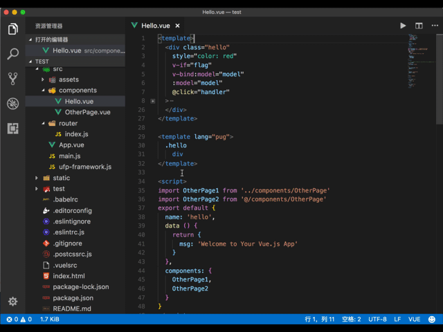

# Vue Language Service for Visual Studio Code

This extension adds Vue Language Service into Visual Studio Code.

这个扩展为 VSCode 增加了 vue 语言服务，解决 vue 单文件组件(.vue)文件的语法识别问题。

## Add Supported languages

* vue(.vue)

## Support Syntax HighLight and Code Completion

* template tag
  * html
    * style(css)
    * vue directive(javascript)
    * vue text interpolation(javascript)
  * jade/pug
* style tag
  * css
  * scss
  * less
* script
  * javascript



## Support Code Format

* html
* javascript
* typescript
* css
* less
* scss

## Support JavaScript import/require file link


## To support file path alias

* Create .vuelsrc file in project root dir
* Add content:

```javascript
const path = require('path')

function resolve (dir) {
  return path.join(__dirname, dir)
}

module.exports = {
  resolve: {
    alias: {
      '@': resolve('src')
    }
  }
}
```

## Support Lint

## To Support ESLint

Add Settings:

```json
"eslint.validate": [
  "javascript",
  "javascriptreact",
  "vue",
  "html"
]
```

## To Support Emmet

Add Settings:

```json
"emmet.includeLanguages": {
  "vue": "html"
}
```

## Base on
[vue-syntax-highlight (vue.tmLanguage)](https://github.com/vuejs/vue-syntax-highlight/blob/master/vue.tmLanguage)
